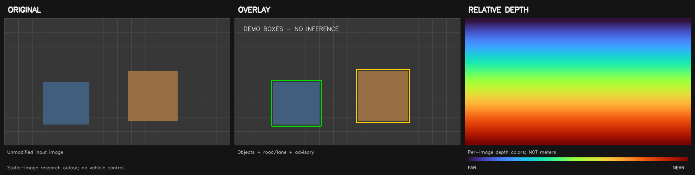

# RoadScene-FailAware

Static road-scene inference with **YOLO11x-seg + HybridNets-D3 + Depth Anything
V2 ViT-L**, followed by an auditable, fail-aware fusion layer.

**Inference only.** This repository does not train the three pretrained models,
does not use RoadScope/EdgeADAS, and does not include flood-competition code.

## Original | Overlay | Depth

Each input image produces a three-panel comparison and separate image/JSON
artifacts. This screenshot demonstrates the layout using **synthetic test data**;
it is not a model prediction or an experimental result.



| Component | Purpose | Fixed paper profile |
|---|---|---|
| YOLO11x-seg | Object boxes, classes and instance masks | 960px, confidence 0.15 |
| HybridNets-D3 | Drivable-road and lane masks | 640px |
| Depth Anything V2 ViT-L | Dense relative-depth field | 518px |
| Fusion layer | Depth reliability, path relation and advisory gates | Relative-depth mode |

The output includes `STABLE / CHECK / UNCERTAIN`, `PATH / EDGE / SIDE`, scene
quality, advisory evidence, and a bounded detector-empty corridor fallback.

## Quick start - Windows / PowerShell

Requires Python 3.11 and sufficient memory for all three models.
Open PowerShell in the repository folder:

```powershell
py -3.11 -m venv .venv
& .\.venv\Scripts\python.exe -m pip install -r requirements.txt
& .\.venv\Scripts\python.exe -m pip check
```

The default requirements retain the existing CUDA 11.8 / PyTorch 2.7.1 recipe.
For CPU-only use, install `requirements-cpu.txt` instead. CPU inference may be
slow. The historical dependency snapshot is under
`docs/environment_snapshot.txt`; it is not a fresh-install guarantee.

### 1. Prepare official pretrained weights

Weights are **not bundled** and are ignored by Git:

```text
yolo11x-seg.pt
hybrid2/weights/hybridnets.pth
checkpoints/depth_anything_v2_vitl.pth
```

See [weight setup](docs/WEIGHTS.md) for the official sources, known hashes and
how to reuse local weights. Do not rename a YOLO11m checkpoint as YOLO11x.

### 2. Choose images and run

Place your images in `input/`, then double-click **RUN.bat**, or run:

```powershell
& .\.venv\Scripts\python.exe run_paper.py input --output-dir outputs\paper

# One image:
& .\.venv\Scripts\python.exe run_paper.py 'input\scene.jpg' --output-dir outputs\paper

# Check the profile without models/GPU/weights:
& .\.venv\Scripts\python.exe run_paper.py --dry-run 'input\scene.jpg'

# Check dependencies and checkpoint hashes; no inference:
& .\.venv\Scripts\python.exe run_paper.py --check
```

Use **run_paper.py**, not `test3.py` directly: the recovered source has different
defaults, while the launcher fixes the requested paper model profile and
disables auxiliary detection and adaptive confidence.

### 3. Open the comparison image

For `scene.jpg`, `outputs/paper/` receives:

| File | Contents |
|---|---|
| `upgraded_scene_comparison.png` | **Original \| overlay \| relative depth** |
| `upgraded_scene_original.png` | Unmodified input |
| `upgraded_scene_overlay.png` | Object masks/boxes, road/lane and advisory |
| `upgraded_scene_relative_depth.png` | Per-image colorized relative depth |
| `upgraded_scene_raw_depth.npy` | Unnormalized model output |
| `upgraded_scene.jpg` | Original annotated view with detection details |
| `upgraded_scene.json` | Object-level audit and artifact paths |

Warm colors indicate relatively nearer structure and cool colors farther
structure **within the same image**. Colors are normalized at the 2nd/98th
percentiles and do not represent meters. Visualization reuses the existing
depth inference rather than running another model pass.

## Tests and GitHub checks

```powershell
# Lightweight tests do not require model weights or a GPU.
& .\.venv\Scripts\python.exe -m unittest discover -s tests -v
& .\.venv\Scripts\python.exe scripts\check_repository.py
```

GitHub Actions runs syntax, repository-safety and visualization/profile tests.
It does not train models, download weights or run full model inference. A fresh
lightweight test environment can use `requirements-test.txt`.

## Repository layout

```text
RoadScene-FailAware/
|-- run_paper.py                  # Fixed inference profile launcher
|-- test3.py                      # Recovered fusion + presentation outputs
|-- paper_config.json             # Explicit paper/model settings
|-- paper_visualization.py        # Original / overlay / depth rendering
|-- weights_manifest.json         # Official sources and known checkpoint hashes
|-- RUN.bat                      # Windows launcher
|-- prepare_local_weights.ps1    # Copy existing local weights without overwriting
|-- requirements*.txt
|-- depth_anything_v2/            # Vendored existing depth implementation
|-- hybrid2/                      # Vendored existing HybridNets implementation
|-- static_training/              # Hard-set selection/audit helpers, NOT training
|-- provenance/                   # Unchanged original fusion source
|-- tests/
|-- scripts/
|-- docs/
|-- input/                        # Private images, ignored by Git
|-- outputs/                      # Generated results, ignored by Git
`-- .github/workflows/tests.yml
```

## Three-person team

See [TEAM_ROLES.md](docs/TEAM_ROLES.md): object detection/masks; road/lane and
path/advisory reasoning; relative depth/reliability and visualization. Integration
and experiment review are shared responsibilities.

## Reproducibility and limitations

- The model names/resolutions/confidence match the supplied paper profile.
  Enhancement `auto`, TTA `full`, precision filter `strict` and tile `off` are
  recovered implementation choices not fully specified in the PDF.
- Exact original 100-image hard-set IDs and original per-image outputs were
  not recovered. Do not claim the historical paper tables have been reproduced.
- Local launcher, rendering, syntax and fusion-AST equivalence checks passed.
  End-to-end YOLO11x-seg inference was not run during repository preparation
  because the YOLO11x-seg checkpoint was absent locally.
- Relative depth is not calibrated distance. `STABLE` indicates internal
  agreement, not ground-truth accuracy. No speed, TTC, tracking or steering
  safety is estimated. Advisories must not drive vehicle actuators.

See [REPRODUCIBILITY.md](docs/REPRODUCIBILITY.md) for the experiment procedure.

## GitHub upload and provenance

Upload instructions: [GITHUB_UPLOAD.md](docs/GITHUB_UPLOAD.md).
The repository has no configured remote and has not been published automatically.

The group's contribution is the integration/fail-aware logic, not ownership of
the pretrained architectures. Upstream attribution and component licenses are
preserved; see [THIRD_PARTY_NOTICES.md](THIRD_PARTY_NOTICES.md) and
[LICENSE_POLICY.md](LICENSE_POLICY.md). No new blanket license is assigned to
the combined repository.
